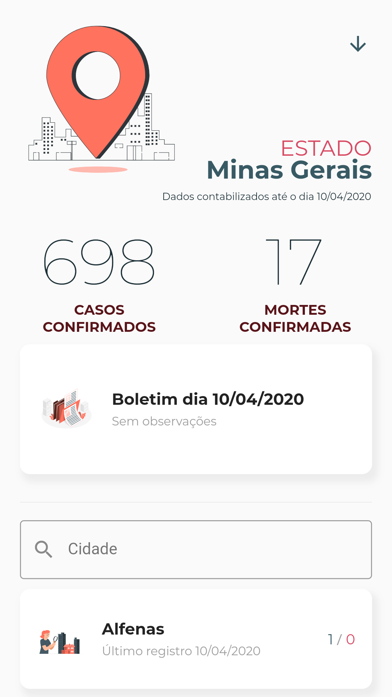
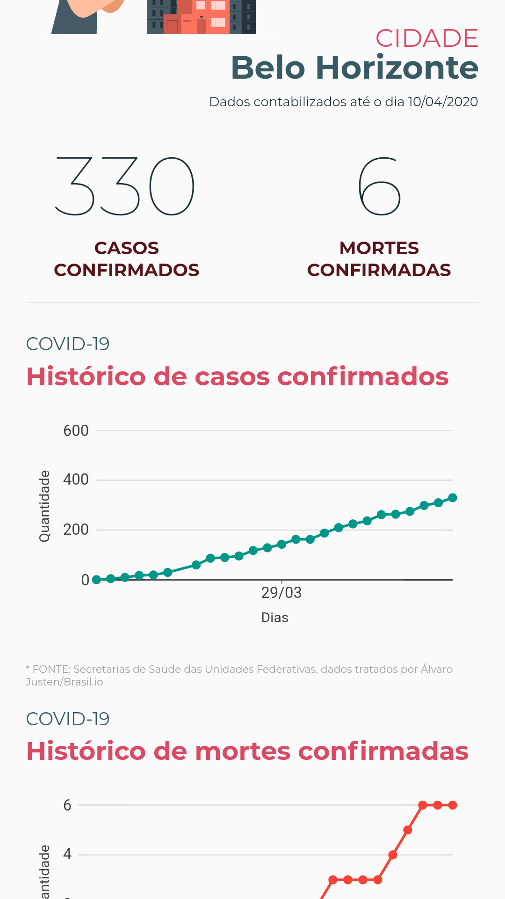

# 📱 COVID 19 Monitor 🦠

<div style="text-align: center"><table><tr>
  <td style="text-align: center">
    
</td>
  <td style="text-align: center">
    
</td>
  <td style="text-align: center">
    
</td>
<td style="text-align: center">
    
</td>

</tr></table></div>

Aplicativo desenvolvido em flutter com a intenção de fornecer aos usuários, [dados oficiais](https://github.com/turicas/covid19-br) registrados pelas secretarias de saúde sobre o coronavirus nas cidades e estados brasileiros e tratados pelo [Álvaro Justen](https://github.com/turicas)/[Brasil.io](https://brasil.io/home)
Além de trazer informações sobre sintomas e prevenção, permitindo também um redirecionamento para os bots oficiais do ministério da saúde e OMS para maiores informações a respeito da COVID.

## Instalação

Para instalar, basta executar o código na pasta raiz da aplicação.

```bash
flutter pub get
```

Em seguida,
```bash
flutter run
```


## Contribuições
_Pull requests_ são sempre bem vindos. Para maiores mudanças, favor abrir uma _issue_ para discussões.


## License
[MIT](https://choosealicense.com/licenses/mit/)